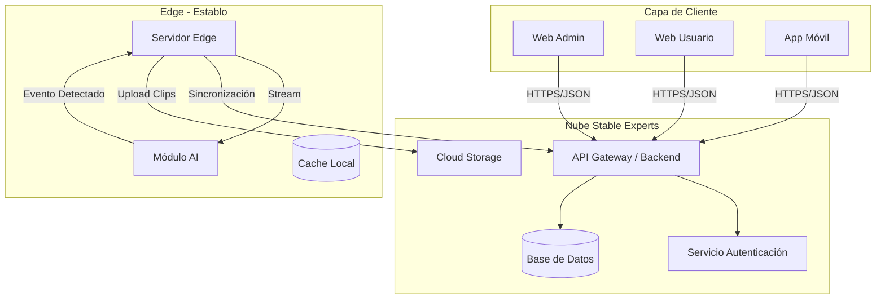

a# Componentes del Sistema

El sistema se divide en cuatro componentes principales que interactúan entre sí para ofrecer la solución completa.

## 1. Front End Web (Administrador)
Panel de control robusto diseñado para la gestión integral de la plataforma.
- **Tecnología:** React / Next.js (SPA).
- **Funcionalidades:**
    - Gestión de usuarios y roles.
    - Configuración de dispositivos y establos.
    - Auditoría y reportes globales.
- **Objetivo:** Permitir a los administradores del sistema y gerentes de establo controlar la operación macro.

## 2. Front End Web (Usuario)
Interfaz ligera y adaptativa enfocada en la visualización y operación diaria.
- **Tecnología:** React (PWA) con diseño Responsive.
- **Funcionalidades:**
    - Registro de nuevos usuarios.
    - Visualización de dashboard de estado de los caballos.
    - Recepción de alertas.
- **Accesibilidad:** Optimizado para funcionar fluidamente en tablets y móviles vía navegador.

## 3. App Móvil (Híbrida)
Aplicación nativa/híbrida para gestión en movimiento, crítica para el personal de campo (veterinarios, entrenadores).
- **Tecnología:** Flutter / React Native.
- **Funcionalidades:**
    - Notificaciones Push en tiempo real.
    - Acceso rápido a historias clínicas.
    - Gestión de usuarios y tareas básicas de administración.

## 4. Servidor Local (Edge Server)
El "cerebro" físico instalado dentro de cada establo. Actúa como el puente crítico entre el mundo físico y digital.
- **Hardware:** Servidor compacto de alto rendimiento (ej. NVIDIA Jetson o Mini PC con GPU).
- **Funcionalidades Clave:**
    - **Ingesta de Video:** Recibe streams de múltiples cámaras térmicas simultáneamente.
    - **Procesamiento AI:** Ejecuta algoritmos de visión artificial para detectar anomalías (ej. caballo acostado, fiebre) localmente.
    - **Filtrado Inteligente:** Solo envía a la nube los clips de video relevantes (eventos), ahorrando ancho de banda.
    - **Buffer Local:** Almacena datos temporalmente si hay corte de internet para sincronizarlos después.

---

## Diagrama de Contenedores

Interacción detallada entre los componentes y servicios.

