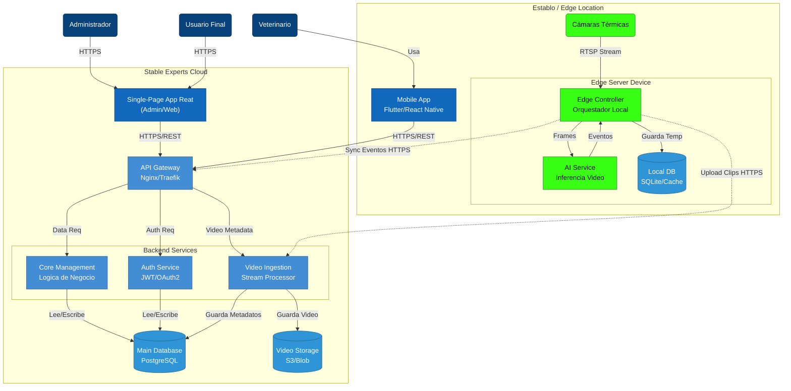

# Diagrama de Contenedores

Este documento detalla la arquitectura de contenedores del sistema **Stable Experts**, mostrando las decisiones de diseño sobre microservicios y almacenamiento de datos.

## Estrategia de Base de Datos y Servicios

El sistema utiliza un enfoque híbrido para equilibrar la consistencia de datos global con la autonomía operativa local:

1.  **Nube (Cloud):**
    *   **Base de Datos Centralizada:** Servicios como *Auth* y *Core Management* comparten una base de datos relacional robusta (ej. PostgreSQL) para garantizar la integridad de usuarios, roles y configuración global.
    *   **Almacenamiento de Objetos:** Los videos y clips se almacenan en un servicio especializado (ej. S3/Blob Storage) para eficiencia y costo, referenciados por metadatos en la DB.

2.  **Borde (Edge - Establos):**
    *   **Base de Datos Local:** Cada instancia Edge tiene su propia base de datos ligera (ej. SQLite/Redis) para operar desconectada.
    *   **Sincronización:** Un proceso dedicado sincroniza los eventos críticos con la nube cuando la conexión está disponible.

## Diagrama C4: Nivel Contenedor

El siguiente diagrama muestra los contenedores desplegables y sus interacciones.

### Descripción de Componentes

| Contenedor | Tipo | Responsabilidad Principal | Tecnología |
| :--- | :--- | :--- | :--- |
| **Web App** | SPA | Interfaz para usuarios y administración. | React, TypeScript |
| **Mobile App** | Mobile | Interfaz para trabajo de campo y alertas. | Flutter / React Native |
| **API Gateway** | Infra | Punto de entrada único, manejo de tráfico y SSL. | Nginx / Cloud Load Balancer |
| **Auth Service** | Microservicio | Gestión de identidad y tokens. | Node.js / Go |
| **Core Service** | Microservicio | Lógica de negocio principal (caballos, establos). | Node.js / Python |
| **Main DB** | Base de Datos | Fuente de verdad única para datos estructurados. | PostgreSQL |
| **Edge Controller** | Servicio Local | Ingesta de cámaras y gestión offline. | Python / C++ |
| **AI Service** | Servicio Local | Procesamiento de video en tiempo real. | TensorFlow / PyTorch |
