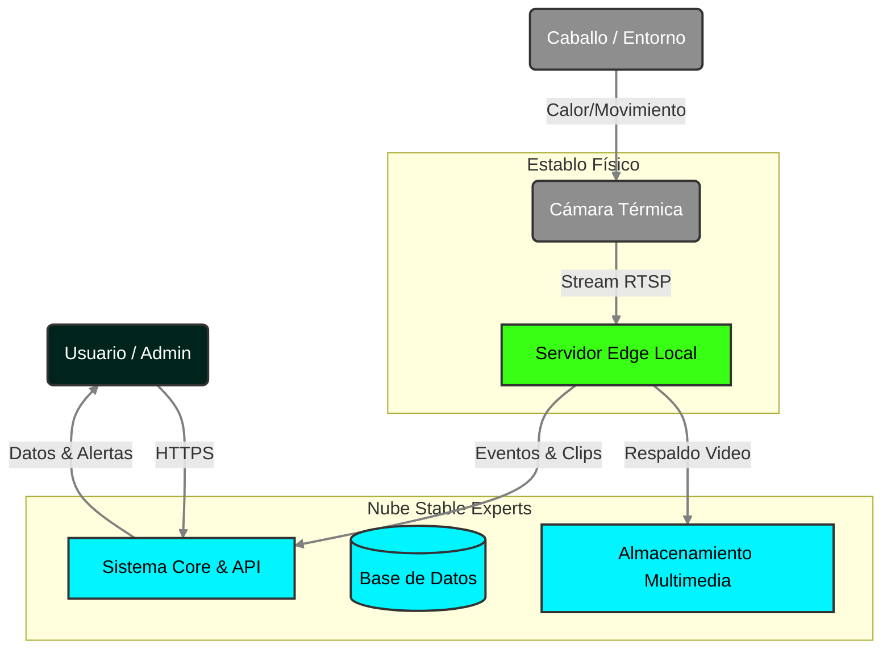

# Arquitectura del Sistema

**Stable Experts** está construido bajo una arquitectura modular de microservicios, diseñada para operar en un entorno híbrido (**Cloud + Edge**). Esta estructura garantiza alta disponibilidad, escalabilidad y una respuesta inmediata ante eventos críticos en los establos.

## Visión General
El sistema integra dispositivos IoT in-situ con una plataforma en la nube robusta. El procesamiento pesado de video e inteligencia artificial se descentraliza hacia servidores locales (Edge) para reducir la latencia, mientras que la gestión administrativa y el acceso global se centralizan en la nube.

### Diagrama de Contexto
A continuación se muestra cómo interactúan los usuarios y el entorno físico con la solución.

## Principios de Diseño
- **Latencia Mínima:** Procesamiento en el borde para alertas en tiempo real.
- **Microservicios:** Desacoplamiento de funciones (Auth, Gestión, Ingesta) para facilitar el mantenimiento.
- **Offline-First:** Capacidad de operar localmente si falla la conexión a internet.
