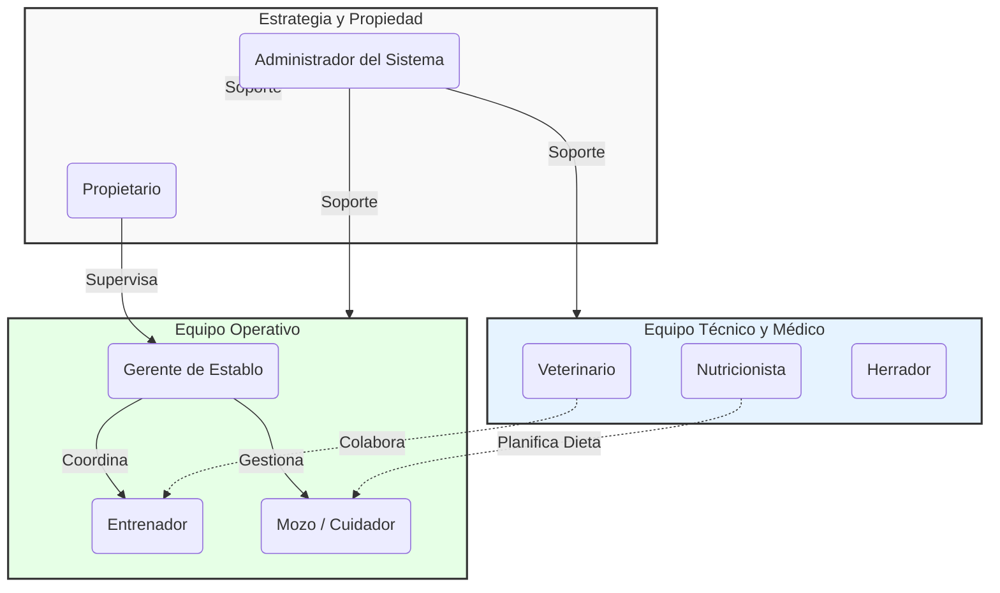

# Actores del Sistema

En **Stable Experts**, diversos actores interactúan con la plataforma para garantizar el bienestar equino, optimizar operaciones y tomar decisiones basadas en datos. A continuación se detallan los roles principales:

## 1. Equipo Técnico y Médico
### Veterinario
- **Responsabilidad:** Monitoreo de salud, diagnóstico y tratamiento .
- **Interacciones:**
    - Carga y visualización de historias clínicas.
    - Análisis de alertas generadas por sensores térmicos y de comportamiento.
    - Planificación de tratamientos y recuperaciones.

### Nutricionista
- **Responsabilidad:** Gestión de la dieta y suplementación.
- **Interacciones:**
    - Configuración de planes de alimentación personalizados.
    - Monitoreo de consumo y peso del animal.

### Herrador (Farrier)
- **Responsabilidad:** Cuidado de los cascos y herrajes.
- **Interacciones:**
    - Registro de mantenimientos y correcciones podales.
    - Programación de próximas visitas.

## 2. Equipo Operativo y de Entrenamiento
### Gerente de Establo (Stable Manager)
- **Responsabilidad:** Supervisión general de la operación diaria.
- **Interacciones:**
    - Gestión de personal (turnos, tareas).
    - Supervisión de inventarios (alimento, medicina, equipamiento).
    - Reportes generales de estado del establo.

### Entrenador (Trainer)
- **Responsabilidad:** Rendimiento físico y preparación para competencias.
- **Interacciones:**
    - Diseño y seguimiento de planes de entrenamiento.
    - Análisis de métricas de rendimiento (velocidad, ritmo cardiaco).

### Mozo / Cuidador (Groom)
- **Responsabilidad:** Cuidado diario directo de los caballos.
- **Interacciones:**
    - Registro de alimentación diaria.
    - Reporte de anomalías visuales o comportamentales.
    - Confirmación de tareas de limpieza y mantenimiento.

## 3. Estrategia y Propiedad
### Propietario (Owner)
- **Responsabilidad:** Inversión y toma de decisiones estratégicas.
- **Interacciones:**
    - Visualización de reportes de estado y progreso de sus ejemplares.
    - Acceso a videos en tiempo real (si está habilitado).
    - Recepción de notificaciones importantes sobre salud o competencias.

### Administrador del Sistema
- **Responsabilidad:** Mantenimiento de la plataforma Stable Experts.
- **Interacciones:**
    - Gestión de usuarios y permisos.
    - Configuración de integraciones con dispositivos IoT.
    - Auditoría de seguridad y datos.
