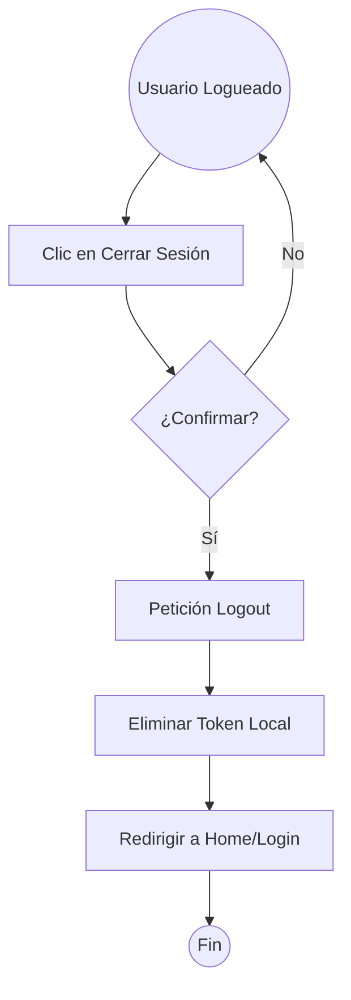

# CU-04: Cierre de Sesión

### 1. Detalles del Caso de Uso

| Elemento | Descripción |
| :--- | :--- |
| **Nombre del caso de uso** | Cierre de Sesión (Logout). |
| **Actor principal** | Usuario Autenticado. |
| **Descripción** | Permite al usuario finalizar su sesión de forma segura. |
| **Postcondiciones** | El token de sesión es invalidado (si aplica lista negra) o eliminado del cliente. El usuario es redirigido al Login. |

### 2. Diagrama de Actividad

